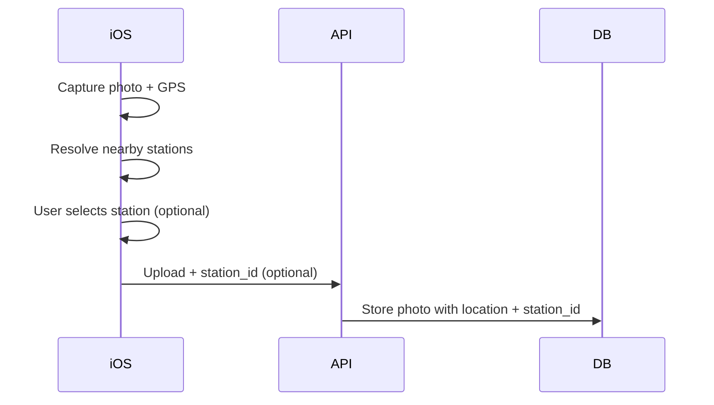

# MetroAI API Contract

**Version:** 0.1.0  
**Last updated:** 2025-02-13

Formal API contract with request/response schemas for iOS integration. For endpoint reference, see [API_SPEC.md](API_SPEC.md).

---

## Authentication

Protected endpoints require `Authorization: Bearer <access_token>` header.

### POST /api/auth/register

Create a new user and return tokens.

**Request:**

```json
{
  "username": "string",
  "email": "user@example.com",
  "password": "string"
}
```

| Field | Type | Required | Validation |
|-------|------|----------|------------|
| username | string | Yes | 1–255 chars |
| email | string | Yes | Valid email |
| password | string | Yes | min 8 chars |

**Response:** TokenResponse

### POST /api/auth/login

Login with username or email and password.

**Request:**

```json
{
  "username_or_email": "string",
  "password": "string"
}
```

**Response:** TokenResponse

### POST /api/auth/refresh

Exchange refresh token for new access and refresh tokens.

**Request:**

```json
{
  "refresh_token": "string"
}
```

**Response:** TokenResponse

### TokenResponse

```json
{
  "access_token": "string",
  "refresh_token": "string",
  "token_type": "bearer"
}
```

---

## Photo Upload

**Endpoint:** `POST /api/photos/upload`  
**Content-Type:** `multipart/form-data`  
**Auth:** Required (Bearer token)

### Form Fields

| Field | Type | Required | Description |
|-------|------|----------|-------------|
| `file` | File | Yes | Image file (JPEG/PNG) |
| `metadata` | JSON string | Yes | JSON string with location + defect (see below) |

### PhotoUploadMetadata (JSON)

Single payload: location/station + defect. Station ID is a string from `GET /api/stations`.

```json
{
  "latitude": null,
  "longitude": null,
  "station_id": null,
  "captured_at": null,
  "defect_id": "uuid",
  "notes": null
}
```

| Field | Type | Required | Validation | Description |
|-------|------|----------|------------|-------------|
| `latitude` | float \| null | No | -90 to 90 | GPS latitude |
| `longitude` | float \| null | No | -180 to 180 | GPS longitude |
| `station_id` | string \| null | No | - | Station ID (string) from GET /api/stations |
| `captured_at` | ISO 8601 \| null | No | - | When photo was captured |
| `defect_id` | UUID | Yes | Must exist in GET /api/defect-types | Defect UUID from defect-types endpoint |
| `notes` | string \| null | No | - | Optional notes |

**Validation rules:**

- If `station_id` is provided, it must exist in the stations table (400 Bad Request otherwise).
- Latitude -90 to 90, longitude -180 to 180.

### Photo Upload Response (SubmissionResponse)

Returns current user points after successful upload.

```json
{
  "points": 101
}
```

| Field | Type | Description |
|-------|------|-------------|
| points | int | Updated points for current user after upload |

**Duplicate:** If the same image (same content hash after processing) was already uploaded, the API returns **409 Conflict** with `detail: "Duplicate photo: same file already uploaded"`.

---

## Annotations

Annotation is created only with photo upload (see Photo Upload). There is no separate `POST /api/annotations`. One annotation per photo (1:1).

### PATCH /api/photos/{photo_id}/annotation

Update the annotation for a photo. **Auth:** Required (Bearer token). **Authorization:** Photo owner only; **403 Forbidden** if the current user is not the photo owner.

**Request body:** All fields optional; only provided fields are updated. Same field names and types as in PhotoUploadMetadata (defect_id, notes, latitude, longitude, station_id, captured_at). Validation: defect_id must exist in Defect table (see GET /api/defect-types); if station_id is provided, it must exist in the stations table.

**Response:** AnnotationResponse. **404** if photo or annotation not found.

---

## Defect types

**Endpoint:** `GET /api/defect-types`  
**Auth:** Not required

Returns defect categories keyed by slug. Each value has `name` (category display name) and `defects` (array of objects with `id` and `name`). Use defect `id` as `defect_id` in photo upload and PATCH.

### Response

Object with category slugs as keys (e.g. `seats`, `walls`, `floor_ceiling`). Each value:

| Field | Type | Description |
|-------|------|-------------|
| name | string | Category display name |
| defects | object[] | Each has `id` (UUID) and `name` (string). Use `id` as defect_id. |

Example: `{ "seats": { "name": "Сиденья", "defects": [{"id": "uuid", "name": "Порез/Разрыв"}, ...] }, ... }`

---

## Stations

**Endpoint:** `GET /api/stations`  
**Auth:** Not required

Returns all Moscow metro stations (seeded from HH metro API). Use `id` in upload metadata as `station_id`.

### Response

Array of:

| Field | Type | Description |
|-------|------|-------------|
| id | string | Station ID (string from HH API, use in upload metadata) |
| name | string | Station name |
| line_id | string | Line identifier |
| line_name | string | Line name |
| geo_lat | float \| null | Latitude |
| geo_lon | float \| null | Longitude |
| is_closed | boolean | Station closed |

---

## Lines

**Endpoint:** `GET /api/lines`  
**Auth:** Not required

Returns all Moscow metro lines.

### Response

Array of:

| Field | Type | Description |
|-------|------|-------------|
| id | string | Line ID (string from HH API) |
| name | string | Line name |
| hex_color | string | Hex color code for the line |

---

## Bootstrap

**Endpoint:** `GET /api/bootstrap`  
**Auth:** Not required

Returns defect types, stations, and lines in one payload for mobile app initialization. This endpoint combines the data from `GET /api/defect-types`, `GET /api/stations`, and `GET /api/lines` into a single response.

### Response

```json
{
  "defect_types": {
    "seats": {
      "name": "Сиденья",
      "defects": [
        {"id": "uuid", "name": "Порез/Разрыв"},
        ...
      ]
    },
    ...
  },
  "stations": [
    {
      "id": "1",
      "name": "Сокольники",
      "line_id": "1",
      "line_name": "Сокольническая",
      "geo_lat": 55.789,
      "geo_lon": 37.680,
      "is_closed": false
    },
    ...
  ],
  "lines": [
    {
      "id": "1",
      "name": "Сокольническая",
      "hex_color": "E32526"
    },
    ...
  ]
}
```

| Field | Type | Description |
|-------|------|-------------|
| defect_types | object | Same structure as `GET /api/defect-types` response (slug -> { name, defects: [{ id, name }] }) |
| stations | array | Same structure as `GET /api/stations` response (array of station objects) |
| lines | array | Same structure as `GET /api/lines` response (array of line objects with id, name, hex_color) |

---

## User Stats

**Endpoint:** `GET /api/user/stats`  
**Auth:** Required (Bearer token)

### Response

```json
{
  "user_id": "uuid",
  "username": "string",
  "points": 100,
  "photos_uploaded": 25
}
```

---

## Leaderboard

**Endpoint:** `GET /api/leaderboard`  
**Auth:** Not required (public)

### Query Params

| Param | Type | Default | Description |
|-------|------|---------|-------------|
| limit | int | 10 | 1–100, max entries |
| offset | int | 0 | Skip first N entries |

### Response

Array of `{ "user_id": uuid, "username": string, "points": int, "rank": int }`. Rank is 1-based (offset + position in page).

---

## Dataset Export

**Endpoint:** `GET /api/export/dataset`  
**Auth:** Admin only. Bearer token required. Non-admin users receive **403 Forbidden** ("Admin access required").

### Query Params

| Param | Type | Default | Description |
|-------|------|---------|-------------|
| `format` | string | `json` | `csv` or `json` — format of the dataset file |
| `include_images` | boolean | `false` | If true, response is a ZIP containing dataset file + images |

### Response

- **Without images:** `format=csv` → `text/csv` body (dataset.csv). `format=json` → `application/json` body (dataset.json).
- **With images:** `application/zip` with `Content-Disposition: attachment; filename=metroai-dataset.zip`. Flat layout: `dataset.csv` or `dataset.json` at root; image files named `{photo_id}.jpg` (or `.png`) at root.

### CSV columns

photo_id, user_id, file_path, file_hash, uploaded_at, captured_at, latitude, longitude, station_id, annotation_id, defect_id, defect_name, notes, annotation_created_at. One row per photo.

### JSON structure

List of objects: each has photo fields (photo_id, user_id, file_path, file_hash, uploaded_at) and a single `annotation` object (annotation_id, defect_id, defect_name, notes, created_at, captured_at, latitude, longitude, station_id).

---

## Enums

### Defect types

See `GET /api/defect-types` for categories and defects (each with `id` and `name`). Use defect `id` as `defect_id` in upload and PATCH.

---

## Error Response Format

```json
{
  "detail": "Error message or validation details"
}
```

For validation errors, `detail` is an array of objects:

```json
{
  "detail": [
    {
      "loc": ["body", "latitude"],
      "msg": "ensure this value is less than or equal to 90",
      "type": "value_error.number.not_le"
    }
  ]
}
```

---

## Location and Station Selection Flow


